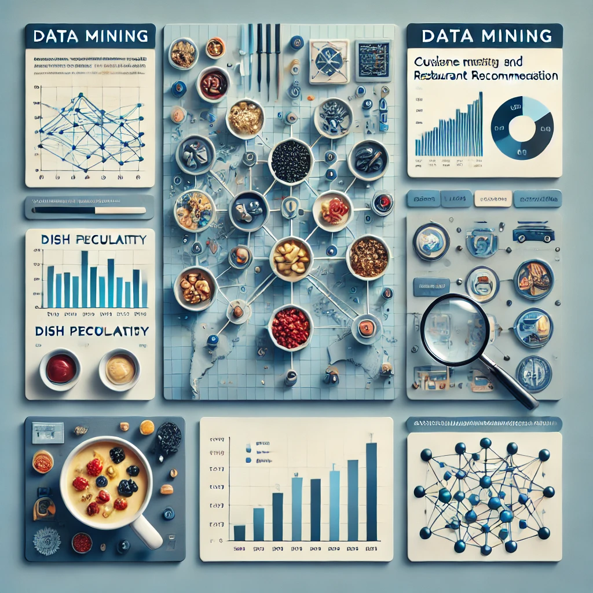

# DishRanker-Focuses-on-ranking-dishes-and-restaurant-recommendations.

# < image generated by chatpgt>

This project explores data mining techniques for analyzing restaurant reviews, focusing on cuisine mapping, dish recognition, ranking mechanisms, and restaurant recommendations. Using natural language processing (NLP) methods such as LDA, LSI, and TF-IDF, generated a cuisine similarity map that clusters similar cuisines based on textual data. Dish recognition is achieved through SegPhrase and ToPMine, allowing for automatic identification and categorization of dish names from large-scale review datasets. Ranking methodologies incorporate frequency counts, sentiment analysis using TextBlob, and average rating calculations to determine the most popular dishes and restaurants. Machine learning models, including Naïve Bayes, SVM, and Gradient Boosting, are employed to predict restaurant hygiene ratings based on review text, helping users make informed dining decisions.

The project also incorporates advanced data visualization techniques, including heatmaps for cuisine similarity, clustering visualizations, and bar charts illustrating dish rankings. A sentiment-based recommendation system is developed to provide more personalized restaurant suggestions. Future work includes deploying this system as an interactive web application, integrating real-time restaurant review data, and further optimizing predictive models. By leveraging NLP and machine learning, this research contributes to developing intelligent
